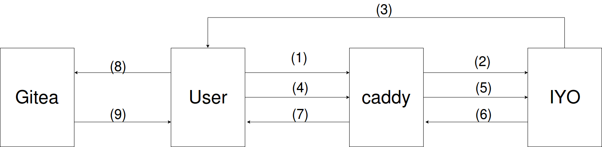

### Running kanban in production with itsyou.online to authenticate users

The authentication for kanban with itsyou.online depends on using caddy server built with iyo plugin. 
 
1 - Make sure to build caddy with iyo plugin (use [caddyman](https://github.com/incubaid/caddyman/) for instructions).

2 - Use iyo branch from kanban repo
```bash
git checkout iyo
```

3 - Make sure you have installed npm libraries and edited `src/http-common.js` file as in [Running](./running.md)  

4 - Build the kanban to be served in production `npm run build`

5 - Make sure that you have already added a login source in gitea instance called `Itsyou.online`.

6 - Create Caddyfile inside `gitea-kanban` directory
```
http://localhost:8000 {
    bind 0.0.0.0
    root dist
    oauth {
        client_id       orgXXXX
        client_secret	  f8G3fX9_4fIhfjxUjZrvFTPrObowRuL1i4iWnlXXXXXXXXXXX
        auth_url        https://itsyou.online/v1/oauth/authorize
        token_url       https://itsyou.online/v1/oauth/access_token
        jwt_url         https://itsyou.online/v1/oauth/jwt
        redirect_url    http://localhost:8000/oauth/callback
        authentication_required /
        extra_scopes   user:name,user:email
    }
}
```
Note that you will need to change the client_id, and client_secret to the same credentials used to create login source in gitea

5 - Make sure that the user you used to login into kanban, already exists in gitea

6 - Add caching configuration section to gitea `custom/conf/app.ini`
```ini
[cache]
ADAPTER = memory
```

7 - run caddy:
```bash
caddy
```

### AuthorizationCodeFlow




1 - The user requests the Kanban served through Caddy

2 - Caddy server will redirect the user to itsyou.online login page to complete authentication 

3 - Itsyou.online will redirect the user back with oauth2 code

4 - User will send the code to caddy server through the call back page

5 - Caddy will request jwt fro itsyou.online

6 - Itsyou.online will return the jwt to caddy server

7 - Caddy server will set the JWT into user cookies

8 - The user will make an ajax request to gitea with the jwt

9 - If the JWT was valid and the user was already registered before in gitea, Gitea will search for any access token created by this user with the name "kanban" and return it. If access_token wasn't found, it will create a new one with the name "kanban" and return it.
   
