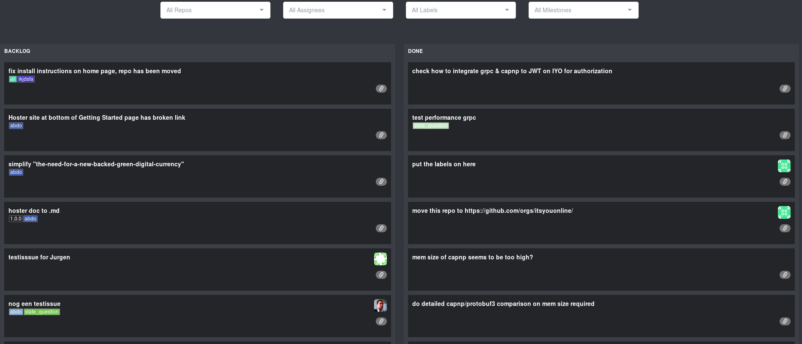
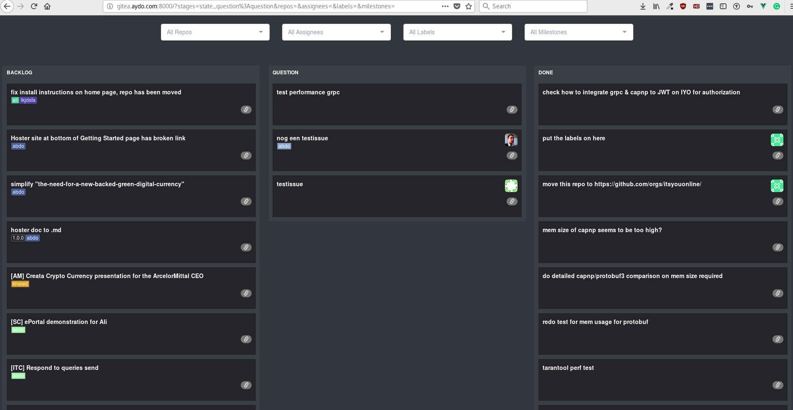

## Usage:

### Stages
By default you will have two stages only `BACKLOG` and `DONE` as shown in the image below

New stage can be added by adding `stages=<giteaLabel1>:<stageLabel1>,<giteaLabel2>:<stageLabel2>` query param in the url and that will map the `giteaLabel` to `stageLabel` representation in the kanban.

### Filters
Gitea Kanban has four filters `repos, assignees, labels, milestones` by which you can filter the issues view as needed. By selecting one or more filter, the URL will be changed accordingly.
